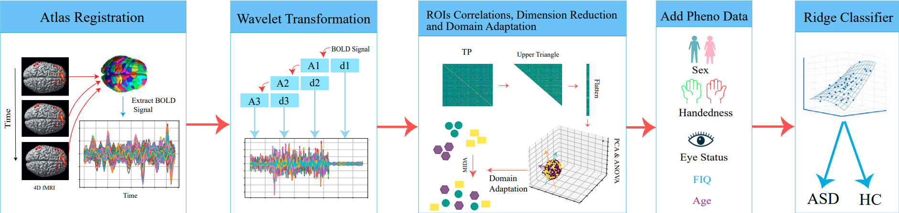
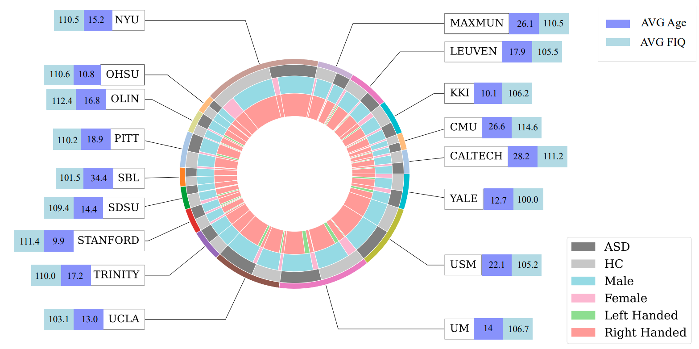

# Autism-Classification
Wavelet Based fMRI Analysis for Autism Spectrum Disorder Detection using Feature Selection and Ridge Classifier

This repository presents a machine learning (ML) based framework designed to enhance ASD diagnosis using fMRI data. Leveraging techniques such as wavelet transform, Tangent Pearson (TP) embedding, Principal Component Analysis (PCA), Analysis of Variance (ANOVA) feature selection, and Maximum Independence Domain Adaptation (MIDA) algorithm, the framework extracts meaningful features from fMRI signals and aligns them for effective classification.

The workflow begins with wavelet transform to extract frequency levels from Blood Oxygen Level-dependent signals. Subsequently, TP embedding, PCA, and ANOVA are employed for feature reduction and selection. To address domain shift induced by different fMRI scanning types, MIDA is applied to align feature representations, ensuring maximal independence while preserving classification-relevant information.

The framework achieves state-of-the-art performance, with an Area Under the Curve (AUC) metric of 79.01% and an accuracy rate of 72.47%.



### Installation

To install the dependencies required for this project, run the following command:

```bash
pip install -r requirements.txt
```
### Download and Preprocess ABIDE Data 

You have the option to either download and preprocess the data yourself or utilize preprocessed data and the Functional Connectivity matrix available at the provided link. After downloading, unzip the files and add the './data' folder to your project directory.

You have two options for accessing and preprocessing the data for this project:

1. **Download and Preprocess Data Yourself:**
   - If you prefer to handle the data preprocessing, you can donload the raw data and preprocess it according to your requirements:
```python
import nilearn
nilearn.datasets.fetch_abide_pcp(data_dir="./data", pipeline="cpac", band_pass_filtering=True,
                                  global_signal_regression=False, derivatives=files, quality_checked=False)
```
   - To preprocess the data, execute the following command in your terminal. Make sure to adjust the parameters in the `./config.py` file according to your preprocessing needs before running the command.

```bash
python fetch_data.py --cfg configs/download_abide.yaml
```


2. **Use Preprocessed Data and Functional Connectivity Matrix:**
   - Alternatively, preprocessed data and the Functional Connectivity matrix are available at [this link](https://drive.google.com/file/d/1sTlyMm1K9nC6B-6_mncN5Urv62B70GJi/view?usp=sharing).
   - After downloading, unzip the files and add the `./data` folder to your project directory.

## Acknowledgements

This project is built upon the code from [
fMRI-site-adaptation]() by [Mwiza Kunda]([link_to_original_author](https://github.com/kundaMwiza/fMRI-site-adaptation)). I utilized their MIDA and Tangent Pearson Embedding and made modifications to suit the requirements of my project.
